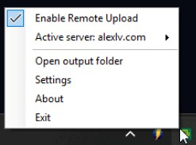
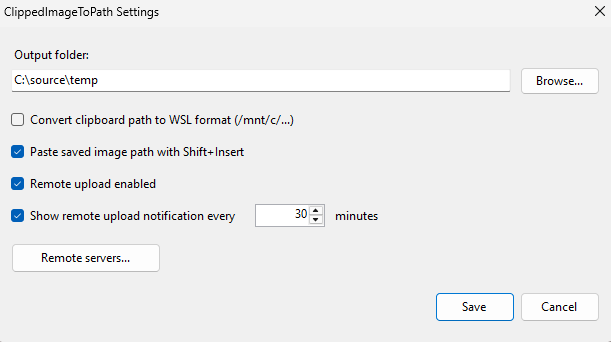

# ClippedImageToPath

ClippedImageToPath is a lightweight Windows tray app that saves copied clipboard images as PNG files. Smart paste keeps the real image available for normal `Ctrl+V` pastes while `Shift+Insert` pastes the saved file path.

This solves the common issue where Windows Terminal cannot paste bitmap clipboard formats directly into CLI tools.

## Main use case: give coding agents your screenshots

Coding agents work with images by **file path**, not by clipboard bitmap. Some (like Claude Code) can already grab an image off your clipboard when they run right there on your Windows box — but that breaks down the moment the agent isn't local:

- **Agent in an SSH terminal on another server.** You literally can't paste an image into that terminal — there's no clipboard there.
- **Working over Remote Desktop, WinSCP, or any remote session.** The screenshot you take is on your side, not on the machine the agent runs on.

That's the gap this fills. Turn on **remote upload** and every screenshot you take automatically lands on the target server (over SFTP/FTP/FTPS). Then you just tell the agent — on the remote dev server, your home PC, wherever it lives — *"check the screenshots at `<the path/folder you configured>`"*, and it can open exactly what you're looking at.

Locally it's just as handy: the clipboard becomes a ready-to-paste path (`"C:\...\clipboard_....png"`, or a `/mnt/c/...` path in WSL mode) for any agent that can't read clipboard images itself.

## Screenshots

Lives quietly in the system tray — right-click for the menu:



The Settings dialog: output folder, WSL path toggle, and remote upload with named server profiles:



## Download

Grab the latest **ClippedImageToPath.exe** from the [Releases page](https://github.com/alexlvcom/clipped-image-to-path/releases/latest) — or directly:

**https://github.com/alexlvcom/clipped-image-to-path/releases/latest/download/ClippedImageToPath.exe**

It's a single, self-contained executable — **no .NET runtime install needed**. Just download and double-click; it starts in the system tray.

### First run: Windows SmartScreen

The exe is **unsigned** (no paid code-signing certificate for a free hobby tool), so Windows may show **"Windows protected your PC."** This is *not* a virus warning — it only means the file is new and hasn't built up download reputation yet. Click **More info → Run anyway**. Prefer to be sure? The source is right here — [build it yourself](#build).

### Verify your download (optional)

Each release lists the SHA-256 of the exe. To check the file you downloaded matches:

```powershell
Get-FileHash .\ClippedImageToPath.exe -Algorithm SHA256
```

Compare the output against the hash on that version's [release page](https://github.com/alexlvcom/clipped-image-to-path/releases/latest).

## What It Does

- Watches clipboard updates in the background
- Detects image content (screenshots, snips, browser images, etc.)
- Saves image as PNG with timestamp name:
  - `clipboard_yyyy-MM-dd_HH-mm-ss_fff.png`
- Keeps the image on the clipboard for Teams, Gmail, and other GUI apps
- On `Shift+Insert`, temporarily supplies the quoted path text
  - Windows mode: `"C:\\...\\clipboard_....png"`
  - Optional WSL mode: `"/mnt/c/.../clipboard_....png"`
- Optional upload to a remote server after the PNG is saved, over SFTP (SSH), FTP, or FTPS (explicit/implicit TLS)
- Optional Windows reminders while remote upload is enabled, with a configurable interval (30 minutes by default)
- Leaves normal text clipboard entries unchanged
- Includes loop-prevention, debounce, retry logic, and dedupe hashing

## Project Layout

- `Program.cs` - app logic, tray UI, settings, clipboard listener
- `ClippedImageToPath.csproj` - project metadata and version

## Build

```powershell
dotnet build -c Release
```

## Publish (single-file)

```powershell
dotnet publish -c Release -r win-x64 --self-contained true -p:PublishSingleFile=true
```

Published executable:

- `bin\\Release\\net8.0-windows\\win-x64\\publish\\ClippedImageToPath.exe`

## Run

Launch the EXE. The app runs in the system tray.

Tray menu:

- `Enable Remote Upload` - checkable item; click to turn remote upload on or off (the menu stays open so you can see the checkbox change)
- `Active server` - pick which server profile uploads use (disabled while remote upload is off)
- `Open output folder`
- `Settings`
- `About`
- `Exit`

## Settings

`Settings` dialog allows:

- Hover over any option to see a short description of what it does
- Output folder for saved PNG files
- Toggle `Convert clipboard path to WSL format (/mnt/c/...)`
- Toggle path paste with `Shift+Insert`
- Toggle `Remote upload enabled`
- Toggle remote upload notifications and choose their interval in minutes (30 by default)
- Manage multiple named remote server profiles (`Remote servers...`): add, edit, remove, and pick which one is active
- Each profile stores protocol (SFTP / FTP / FTPS explicit / FTPS implicit), host, port, user, password, remote directory, and passive mode
- Per-profile test connection button that verifies login and remote directory access
- Switch the active server quickly from the tray menu (`Active server` submenu); uploads use the active profile

Settings are stored at:

- `%APPDATA%\\ClippedImageToPath\\settings.json`

Server passwords in that file are **encrypted with Windows DPAPI (per-user scope)** — they can only be decrypted by the same Windows user account on the same machine, not read as plain text. (Configs from older versions that stored passwords as plain base64 are upgraded automatically on first launch.)

## About Dialog

Shows:

- App name
- Version
- Output folder
- Build date
- Copyright

## Logging

A runtime log is written to:

- `<OutputFolder>\\bridge.log`

## Typical Workflow

1. Copy image (Snipping Tool, browser, screenshot).
2. App saves PNG file.
3. Use `Ctrl+V` to paste the real image into GUI apps, or `Shift+Insert` to paste the quoted path into a terminal.

## Notes

- Works standalone; no clipboard manager is required.
- Clipboard managers (for example, Ditto) are optional and can be used alongside this app.
- If output path has spaces, quoted clipboard text prevents CLI parsing issues.
- In clipboard managers, you may see extra entries for one screenshot or terminal paste:
  - the original image clip from your screenshot tool
  - the temporary path clip written by ClippedImageToPath for a terminal paste
- `Shift+Insert` always requests the saved path, so it also works in terminals hosted inside editors and other applications.
- If you want to hide the app-generated entry, add `ClippedImageToPath.exe` to your clipboard manager's ignore-app list.

## Troubleshooting

- If nothing happens:
  - Ensure app is running in tray.
  - Check `<OutputFolder>\\bridge.log`.
- If clipboard is busy:
  - App retries clipboard access automatically.
- If path format is unexpected:
  - Check `Settings` for WSL conversion toggle.
